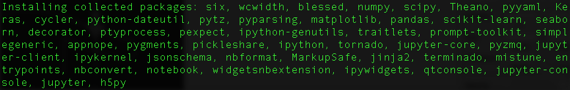

# Getting started with ML101 

This is a getting started guide for beginners to Python who want to run through Francis Tseng's amazing [ML101 workshop notes](https://github.com/frnsys/ml101/tree/master/altai). 

## Never ran a line of Python before? No problem.

You'll need:
* [Homebrew](http://brew.sh/): a package manager for OS X
* Python3
* Python module virtualenv: The virtual environment creates isolated Python environments for each of your projects. Consider this step to be best practice. Pip is a package manager for Python.

1. Launch Terminal and install Python3 with Homebrew.  
``brew install python3``

2. Clone ml101 onto your local machine.  
``git clone https://github.com/frnsys/ml101.git``

2. Navigate into the notebooks folder.  
``cd /your-directory-name/ml101/altai/notebooks``

3. Install the Python package virtualenv.   
``sudo pip3 install virtualenv``

4. Create an instance of your virtualenv and call it "venv"  
``virtualenv -p python3 venv``

5. Activate venv. After doing this, you will see (venv) preceeding each line in your Terminal output.  
``source venv/bin/activate``

6. Navigate one level out of the current folder and install the requirements for each example. If you look in Finder, you'll see that there is a requirements.txt in the /altai folder  
``cd ../``  
``pip install -r requirements.txt``

7. Run the iPython Jupyter Notebook. It is one of the dependencies specified in requirements.txt and was installed when you ran the previous command.  
``jupyter notebook``  

8. If you were able to get the Notebook open yesterday, and tried running a cell, ie the first cell from 01_manual_fit, you may have noticed an error reading 'from lib import make_line'. That's because a dependency blessings was not right. You can use this command to correct this error, as well as other ones similar to this by installing the missing dependency in the /altai folder while you've got your virtualenv running. So the code will look something like the following. When the dependency is installed, you can run Notebook again.  
``(venv) Users-MacBook-Pro:altai mac$ pip3 install blessings``

### Relaunching your environment

Say you closed your Terminal tab or restarted your computer. To get started up again, just navigate to the /ml101/altai/notebooks/ folder and reactivate the virtualenv.  
``source venv/bin/activate``

Then you can continue working with Notebook by typing jupyter notebook.